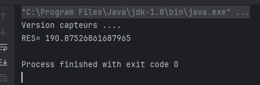

# Rapport TP : Injection des dépendances en Java (Spring, XML, Annotations)

---

## 🎯 Objectif du TP

Ce TP a pour but de comprendre et de mettre en œuvre **l'injection des dépendances** (IoC - *Inversion of Control*) en Java, en utilisant le **Spring Framework**.  

L'objectif principal est de **découpler les différentes parties d'une application** pour :

- Faciliter la maintenance.
- Améliorer la flexibilité.
- Simplifier les tests unitaires.

---

## 📁 Structure du projet

Le projet est organisé en plusieurs packages, chacun jouant un rôle spécifique :

| Package      | Description                                           |
|--------------|-----------------------------------------------------|
| `dao`        | Contient les classes d'accès aux données (`DaoImpl`, `IDao`) |
| `ext`        | Version alternative de la DAO (`DaoImplV2`)          |
| `metier`     | Contient la logique métier (`IMetier`, `MetierImpl`) |
| `pres`       | Différentes présentations pour tester l’application (`Pres1`, `Pres2`, `PresSpringXML`, `PresSpringAnnotation`) |

---

## 🛠️ Méthodes d’injection utilisées

### 1. Injection manuelle via le constructeur

- Dans `Pres1.java`, les instances de DAO et métier sont créées **manuellement**.
- La dépendance est injectée via le **constructeur**.

**Avantage :** Simple mais peu flexible.  
**Inconvénient :** Tout changement nécessite de modifier le code source.

---

### 2. Injection dynamique avec Reflection + fichier de configuration

- Dans `Pres2.java`, la réflexion Java est utilisée pour instancier dynamiquement les classes.
- Les noms des classes sont lus depuis un fichier `config.txt`.
- Cette méthode permet de modifier les implémentations sans toucher au code source.

**Avantage :** Plus flexible, facilite la modification à chaud.  
**Inconvénient :** Complexité accrue et possible perte de sécurité de type.

---

### 3. Injection via Spring XML

- Dans `PresSpringXML.java`, la configuration des beans est réalisée dans un fichier `config.xml`.
- Spring se charge d’instancier et d’injecter les dépendances automatiquement.

**Avantage :** Gestion centralisée et propre des dépendances.  
**Inconvénient :** Nécessite d’apprendre le format XML spécifique.

---

### 4. Injection via Spring Annotations

- Dans `PresSpringAnnotation.java`, on utilise les annotations Spring comme :

  - `@Component` pour déclarer un bean.
  - `@Repository` pour la couche DAO.
  - `@Service` pour la couche métier.
  - `@Autowired` pour injecter automatiquement les dépendances.

- L’application est lancée via un contexte d’annotations.

**Avantage :** Très moderne, facile à lire et à maintenir.  
**Inconvénient :** Peut cacher certains comportements, nécessite une bonne compréhension du framework.

---

## 📷 Exemple de sortie (résultat)

Voici un exemple du résultat affiché lors de l’exécution de `PresSpringAnnotation.java` :

---

## 📚 Concepts clés abordés

- **Couplage faible** via l’utilisation d’interfaces.
- Injection des dépendances par **constructeur** et par **setter**.
- **Instanciation dynamique** avec la réflexion Java.
- Utilisation avancée du **Spring Framework** avec XML et annotations.
- **Modularisation** et organisation claire du projet Java.

---

## 🔍 Conclusion

Ce TP a permis d’expérimenter différentes approches d’injection des dépendances en Java, montrant l’évolution de méthodes simples vers des solutions plus professionnelles et robustes avec Spring.  

La compréhension des principes IoC et DI est essentielle pour construire des applications flexibles et maintenables.

---
